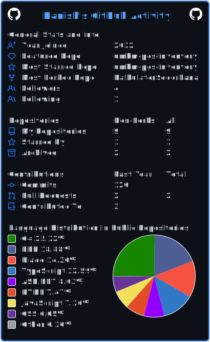

<h1 align="center">Hi, I'm Danish</h1>

  

I’m a full-stack product builder based in Indonesia. I enjoy turning practical
problems into focused web applications, from backend workflows and data models
to interfaces people can use comfortably.

## GitHub overview

  

  

## Featured work

- **[UMKM POS & Inventory](https://github.com/Unknown2-1/umkm-pos-inventory)** — A production-style point-of-sale and inventory system built with Laravel, Livewire, Tailwind CSS, and SQLite.
- **[Galaxy Game](https://github.com/Unknown2-1/galaxygame)** — A Unity space-game prototype with collectible, obstacle, and level-progression mechanics.
- **[Laravel Product API](https://github.com/Unknown2-1/belajar-api-laravel)** — A REST API learning project centered on product and category resources.
- **[Leptren](https://github.com/Unknown2-1/Leptren_2_SCC)** — A responsive laptop-storefront prototype covering common shopping UI flows.

## Contribution activity

  

<picture>
  <source media="(prefers-color-scheme: dark)" srcset="https://raw.githubusercontent.com/Unknown2-1/Unknown2-1/output/github-contribution-grid-snake-dark.svg" />
  <source media="(prefers-color-scheme: light)" srcset="https://raw.githubusercontent.com/Unknown2-1/Unknown2-1/output/github-contribution-grid-snake.svg" />
  
</picture>

## Tools I work with

`PHP` · `Laravel` · `Livewire` · `JavaScript` · `Tailwind CSS` · `SQLite` · `C#` · `Unity` · `Git`

## Bahasa Indonesia

Saya membangun produk digital full-stack dengan fokus pada alur kerja yang
jelas, antarmuka yang nyaman digunakan, dan implementasi yang dapat diuji.

I keep personal details private by design. The best way to follow my work is
through the repositories on this profile.
